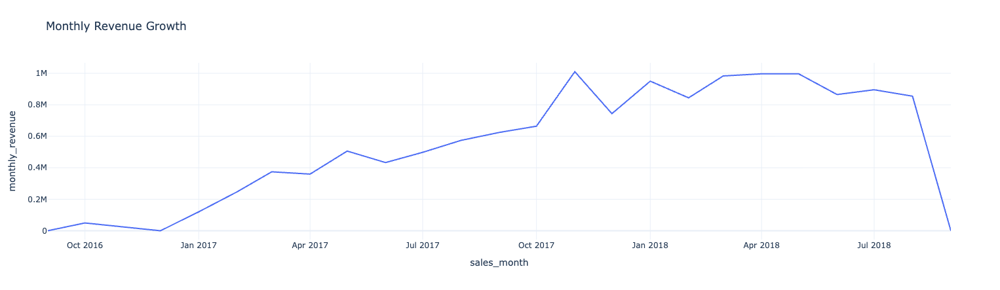
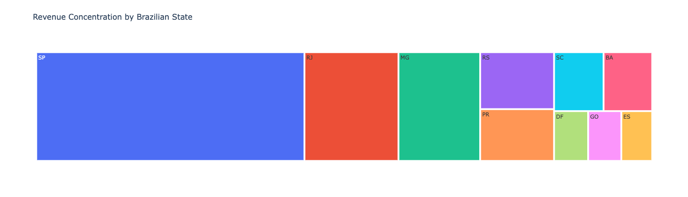

# Olist E-commerce Data Pipeline 🇧🇷

## 📌 Project Overview
This project was built to deepen my expertise in **dbt (Data Build Tool)** and the **Modern Data Stack**. While I have used dbt in the past, this project served as a rigorous practice ground for:
* Implementing a structured **Staging -> Intermediate -> Marts** architecture.
* Handling complex data quality issues (type casting, schema drifts).
* Automating testing via **Singular and Generic** dbt tests.
* Managing a local OLAP environment using **DuckDB**.

The pipeline transforms raw Olist e-commerce data (100k+ orders) into a set of production-ready analytics tables.

---

## 🏗️ Architecture & Lineage
The data flows from raw CSVs into a structured DuckDB database, followed by a multi-layered dbt transformation process.

### 1. Ingestion Layer
* **Tool:** Python/Pandas
* **Process:** Initial cleaning, schema normalization, and persistence to DuckDB.

### 2. Transformation Layer (dbt)
* **Staging:** Primary cleaning and type casting (Varchar to Timestamp).
* **Intermediate:** Joining orders and items to create a unified grain.
* **Marts:** Business-ready tables for Customers and Orders.

### Lineage Graph

> ****

---

## 🌟 Dimensional Modeling (Kimball Star Schema)
To optimize the warehouse for analytics, I implemented a **Kimball Star Schema** in the `marts` layer. This separates the quantitative measurements (Facts) from the descriptive attributes (Dimensions). The relationship between the fact and dimensions table is many-to-one.

* **Fact Table:** `fct_orders_items` — Each row represents an order line item with price, freight, and timestamps.
* **Dimension Tables:** * `dim_customers`: Geographic and demographic data for buyers.
    * `dim_products`: Category translations and product specifications.
    * `dim_sellers`: Seller location and performance attributes.

### Schema Diagram (Star Schema)
Below is the relationship diagram generated from the `marts` layer:

### Relationship Mapping (Star Schema)
Below is the table layout of the Olist Star Schema:

| From (Fact Table) | To (Dimension Table) | Key Column |
| :--- | :--- | :--- |
| **fct_orders_items** | **dim_customers** | `customer_id` |
| **fct_orders_items** | **dim_product** | `product_id` |
| **fct_orders_items** | **dim_sellers** | `seller_id` |

---

## 🧪 Data Quality & Testing
Data integrity was a primary focus of this project.

* **Generic Tests:** Ensured `unique` and `not_null` constraints on primary keys.
* **Singular Tests:** Built custom SQL tests to catch business logic failures:
    * `assert_order_total_matches_payments`: Caught 369 discrepancies in order values.
    * `assert_delivery_date_is_not_in_future`: Verified temporal integrity of historical data.
* **Source Freshness:** Configured DuckDB landing views to monitor data heartbeat.

---

## 📊 Business Insights
The final Marts layer enabled deep-dive analytics into the Brazilian market.

### Monthly Revenue Growth
> ****
*Note the significant spike during Black Friday 2017.*

### Regional Concentration
> ****
*Visualizing the massive market share of São Paulo (SP) compared to other Brazilian states.*

---

## 🛠️ How to Run
1. **Clone the Repo:** `git clone https://github.com/sunilmakkar/olist-e-commerce-data-pipeline.git`
2. **Setup Environment:** `pip install -r requirements.txt`
3. **Run Pipeline:**
    * Execute the `olist_ecommerce_pipeline.ipynb` to ingest data.
    * Run `dbt deps` to install dependencies.
    * Run `dbt run` to build the models.
    * Run `dbt test` to verify data quality.

---

## 🧠 Key Learnings
* **Type Strictness:** Managing DuckDB's strict casting requirements for freshness checks.
* **Refactoring:** Moving logic from Python/Pandas into dbt/SQL for better maintainability and testing.
* **Modular Orchestration:** Designing a DAG (Directed Acyclic Graph) that decouples source data ingestion from analytical transformation, allowing for independent scaling and troubleshooting of the pipeline.

---
**Author:** Sunil Makkar 
[LinkedIn](https://www.linkedin.com/in/sunil-makkar-63827318b/) | [Medium](https://medium.com/@sunil.makkar97)